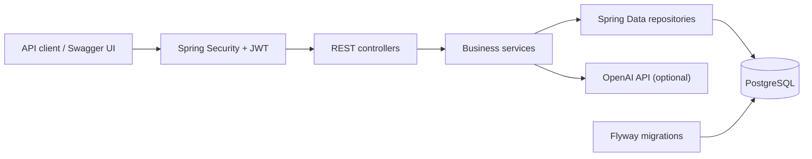

# JobTrail

[](https://github.com/melina-danhier/job-trail/actions/workflows/ci.yml)


**Eine produktionsnah aufgebaute REST-API, die Bewerbungen benutzerspezifisch verwaltet,
Statusverläufe nachvollziehbar macht und Stellenbeschreibungen optional per KI mit dem eigenen
Profil abgleicht.**

JobTrail ist eine REST-API, mit der Benutzer Firmen und Bewerbungen verwalten, Statusänderungen
nachverfolgen und ein eigenes Bewerbungsprofil pflegen können. Der wichtigste Use Case ist ein
persönlicher Bewerbungstracker: Firma anlegen, Bewerbung erfassen und ihren Weg von `SAVED` bis
beispielsweise `INTERVIEW_SCHEDULED`, `OFFER_RECEIVED` oder `REJECTED` dokumentieren. Optional
vergleicht ein KI-gestütztes Matching das Profil mit einer Stellenbeschreibung.

## MVP und bewusste Grenzen

Zum MVP gehören Registrierung und Login, benutzerspezifische Firmen, Bewerbungen mit Filterung
und Statushistorie, ein strukturiertes Profil sowie das optionale Job-Matching. Ein Benutzer kann
dieselbe Kombination aus Firma und Positionsbezeichnung nur einmal anlegen; andere Benutzer
dürfen dieselben Firmen- und Positionsnamen verwenden. Duplikate liefern stabil `409 Conflict`.

Bewusst nicht Teil des aktuellen MVP sind ein Frontend, E-Mail-Verifikation, Passwort-Reset,
Refresh-Tokens, Rollen/Rechte, Datei-Uploads, Benachrichtigungen und kollaborativ geteilte Daten.
Das KI-Matching ist eine Entscheidungshilfe, keine verbindliche Bewertung, und benötigt einen
externen OpenAI-Zugang.

## Tech-Stack und Architektur

- Java 21, Spring Boot 4.1 und Maven Wrapper
- Spring MVC, Bean Validation und Spring Security mit JWT-Bearer-Tokens
- Spring Data JPA/Hibernate, PostgreSQL und Flyway-Migrationen
- MapStruct und Lombok für Mapping beziehungsweise Boilerplate
- Spring AI mit OpenAI für das optionale Job-Matching
- JUnit 5, MockMvc, Mockito und H2 für Tests
- Docker Compose für die lokale PostgreSQL-Instanz

Die Anwendung folgt einer klassischen Schichtung: Controller validieren HTTP-Anfragen, Services
enthalten Fachlogik und Transaktionen, Repositories kapseln JPA-Zugriffe und Mapper trennen DTOs
von Entities. Jede Firma, Bewerbung und jedes Profil ist einem Benutzer zugeordnet. Flyway ist
Eigentümer des Schemas; Hibernate läuft mit `ddl-auto: validate` und verändert es nicht selbst.



## Voraussetzungen

- JDK 21 (`java -version`)
- Docker mit Docker Compose (`docker compose version`)
- freie Ports `5433` für PostgreSQL und `8080` für die API

Eine globale Maven-Installation ist nicht nötig. Unter Windows wird `mvnw.cmd`, unter macOS/Linux
`./mvnw` verwendet.

## Lokales Setup: Docker und Maven

1. PostgreSQL starten:

   ```powershell
   docker compose up -d postgres
   docker compose ps
   ```

2. Laufzeitvariablen in derselben PowerShell setzen. Der JWT-Schlüssel wird für diese Shell neu
   erzeugt und nicht gespeichert:

   ```powershell
   $env:SPRING_PROFILES_ACTIVE = "dev"
   $env:JWT_SECRET = [Convert]::ToBase64String((1..48 | ForEach-Object { Get-Random -Maximum 256 }))
   ```

   `application-dev.yml` verwendet ausschließlich lokal die Compose-Vorgaben `postgres/postgres`.
   Diese Werte sind keine Produktionszugangsdaten. Für eine abweichende lokale Datenbank können
   `DB_USERNAME` und `DB_PASSWORD` gesetzt werden.

3. Build und Tests ohne externen KI-Aufruf ausführen:

   ```powershell
   .\mvnw.cmd clean test
   ```

4. Die API starten. Ein OpenAI-Schlüssel ist für den normalen Bewerbungstracker nicht erforderlich:

   ```powershell
   .\mvnw.cmd spring-boot:run
   ```

   Für echtes Matching wird vor dem Start zusätzlich ein gültiger Schlüssel gesetzt:

   ```powershell
   $env:OPENAI_API_KEY = "<your-api-key>"
   .\mvnw.cmd spring-boot:run
   ```

   Die API ist anschließend unter `http://localhost:8080` erreichbar. Beenden mit `Ctrl+C`, die
   Datenbank mit `docker compose down`. `docker compose down -v` entfernt zusätzlich alle lokalen
   JobTrail-Daten.

Die interaktive OpenAPI-Dokumentation ist unter
`http://localhost:8080/swagger-ui/index.html` verfügbar. Registrierung und Login können dort ohne
Token ausgeführt werden; für die übrigen Endpunkte wird der JWT über **Authorize** eingetragen.
Die maschinenlesbare Spezifikation liegt unter `http://localhost:8080/v3/api-docs`.

Auf macOS/Linux sind die entsprechenden Variablen mit `export NAME=...` zu setzen; die
Maven-Befehle beginnen dort mit `./mvnw`.

### Optional: Anwendungs-Image bauen

Der Build erzeugt ein nicht privilegiert laufendes Java-21-Image:

```powershell
docker build -t jobtrail:local .
```

Das Image nutzt das Profil `prod` und erwartet PostgreSQL unter dem Hostnamen `postgres` sowie
`DB_USERNAME`, `DB_PASSWORD` und `JWT_SECRET` als Laufzeitvariablen. Secrets gehören in eine
Secret-Verwaltung oder die Laufzeitumgebung und niemals in Git oder in das Image.

## Authentifizierung und Beispielzugang

Es gibt keinen vorinstallierten Benutzer. Ein reproduzierbarer Beispielzugang wird selbst über
die API angelegt; die reservierte Domain `.invalid` vermeidet persönliche Daten:

```http
POST /api/auth/register
Content-Type: application/json

{
  "email": "demo@example.invalid",
  "password": "change-me-123"
}
```

Danach liefert der Login den JWT als reinen Text. Er ist eine Stunde gültig:

```http
POST /api/auth/login
Content-Type: application/json

{
  "email": "demo@example.invalid",
  "password": "change-me-123"
}
```

Alle folgenden Routen erwarten `Authorization: Bearer <TOKEN>`. `GET /api/auth/me` liefert den
aktuell angemeldeten Benutzer. Nur Registrierung und Login sind öffentlich. Die Beispielwerte
sind ausschließlich für lokale Entwicklung gedacht.

## API-Überblick

### Reproduzierbarer Demo-Flow

Bei laufender lokaler API spielt das Skript Registrierung, Login, Firma und Bewerbung anlegen,
Liste, Filter, Update, Statuswechsel, Historie und Löschen vollständig durch. Es erzeugt pro Lauf
einen neuen anonymen Benutzer unter der reservierten Domain `.invalid`, prüft alle wesentlichen
Antworten und beendet sich beim ersten Fehler:

```powershell
powershell -NoProfile -ExecutionPolicy Bypass -File .\scripts\demo.ps1
```

Für eine andere Umgebung kann die Basis-URL übergeben werden:

```powershell
powershell -NoProfile -ExecutionPolicy Bypass -File .\scripts\demo.ps1 -BaseUrl "http://localhost:8080"
```

### Firmen

```http
POST /api/companies
Authorization: Bearer <TOKEN>
Content-Type: application/json

{
  "name": "Example GmbH",
  "website": "https://example.com",
  "location": "Berlin"
}
```

- `GET /api/companies` – eigene Firmen auflisten
- `GET /api/companies/{id}` – Firma abrufen
- `PUT /api/companies/{id}` – Firma mit demselben JSON-Format ersetzen
- `DELETE /api/companies/{id}` – Firma löschen

Eine Firma, auf die noch Bewerbungen verweisen, kann nicht gelöscht werden. Die API liefert dafür
einen fachlichen `409 Conflict`; zuerst müssen die betreffenden Bewerbungen entfernt werden.

### Bewerbungen

Die `companyId` stammt aus der Antwort von `POST /api/companies`. Beim Anlegen setzt der Server
den Status immer auf `SAVED`. Create- und Update-Requests akzeptieren bewusst kein `status`-Feld;
unbekannte Felder werden mit `400 Bad Request` abgelehnt.

```http
POST /api/applications
Authorization: Bearer <TOKEN>
Content-Type: application/json

{
  "positionTitle": "Backend Developer",
  "companyId": 1,
  "applicationDate": "2026-07-05",
  "jobUrl": "https://example.com/jobs/backend"
}
```

- `GET /api/applications` – paginierte Liste; optionale Parameter: `page`, `size`, `sortBy`,
  `direction`, `status`, `companyId`, `applicationDateFrom`, `applicationDateTo`
- `GET /api/applications/{id}` – Bewerbung abrufen
- `PUT /api/applications/{id}` – fachliche Bewerbungsdaten vollständig aktualisieren; der Status
  bleibt unverändert
- `DELETE /api/applications/{id}` – Bewerbung löschen
- `GET /api/applications/{id}/status-history` – chronologische Statushistorie

Statusänderungen sind ausschließlich über den dedizierten PATCH-Endpunkt möglich, damit jeder
echte Übergang atomar in der Statushistorie gespeichert wird:

```http
PATCH /api/applications/1/status
Authorization: Bearer <TOKEN>
Content-Type: application/json

{ "status": "INTERVIEW_SCHEDULED" }
```

Erlaubte Statuswerte sind `SAVED`, `APPLIED`, `UNDER_REVIEW`, `INTERVIEW_SCHEDULED`,
`INTERVIEW_COMPLETED`, `OFFER_RECEIVED`, `REJECTED`, `ACCEPTED` und `WITHDRAWN`.

### Profil

Pro Benutzer existiert höchstens ein Profil. `PUT /api/profiles` erwartet wie `POST` immer das
vollständige Profil.

```http
POST /api/profiles
Authorization: Bearer <TOKEN>
Content-Type: application/json

{
  "targetRole": "Java Backend Developer",
  "locationPreference": "Berlin oder remote",
  "availability": "ab sofort",
  "experienceLevel": "JUNIOR",
  "summary": "Fokus auf robuste Web-APIs",
  "skills": [{ "name": "Java", "level": "PROFICIENT", "mainSkill": true }],
  "languages": [{ "language": "Deutsch", "level": "FLUENT" }],
  "projects": [],
  "preferredRoles": ["Backend Developer"],
  "avoidKeywords": ["unbezahltes Praktikum"]
}
```

- `GET /api/profiles` – eigenes Profil abrufen
- `PUT /api/profiles` – eigenes Profil vollständig ersetzen
- `DELETE /api/profiles` – eigenes Profil löschen

### KI-Job-Matching

Hierfür müssen ein Profil und ein gültiger `OPENAI_API_KEY` vorhanden sein. Ohne Schlüssel startet
die restliche API normal; ein Matching-Aufruf liefert dann `503 Service Unavailable`:

```http
POST /api/job-match/analyze
Authorization: Bearer <TOKEN>
Content-Type: application/json

{
  "description": "Gesucht wird ein Java Backend Developer mit Spring Boot und Docker."
}
```

Die Antwort enthält Score, passende und fehlende Skills, Empfehlung und Kurzbegründung. Der
Provider-Aufruf hat 30 Sekunden Timeout, maximal drei Versuche und 700 Ausgabetokens. Pro Benutzer
sind standardmäßig fünf Analysen pro Minute erlaubt; konfigurierbar über
`JOB_MATCH_REQUESTS_PER_MINUTE`. Der lokale Rate Limiter bereinigt inaktive Benutzerfenster
regelmäßig. Er ist für eine einzelne Anwendungsinstanz gedacht; bei horizontaler Skalierung sollte
der Zustand beispielsweise nach Redis oder in ein API-Gateway verlagert werden.

## Konfiguration und Secrets

| Variable | Erforderlich | Zweck |
| --- | --- | --- |
| `JWT_SECRET` | ja | HMAC-Schlüssel für JWT; mindestens 32 zufällige Bytes empfohlen |
| `JWT_EXPIRATION` | nein | Token-Laufzeit als ISO-8601-Dauer, Standard `PT1H` |
| `JWT_ISSUER` | nein | erwarteter JWT-Aussteller, Standard `jobtrail` |
| `OPENAI_API_KEY` | nur für Matching | Zugang zum OpenAI-Modell |
| `DB_USERNAME` | Produktion/optional lokal | PostgreSQL-Benutzer |
| `DB_PASSWORD` | Produktion/optional lokal | PostgreSQL-Passwort |
| `JOB_MATCH_REQUESTS_PER_MINUTE` | nein | Matching-Limit, Standard `5` |

Es werden keine echten Schlüssel, Tokens oder persönlichen Zugangsdaten im Repository erwartet.
Die Datei `.env` ist ignoriert; sensible Werte bleiben in der Umgebung oder Secret-Verwaltung.
Zu kurze JWT-Schlüssel sowie ungültige Laufzeiten oder leere Issuer werden bereits beim Start
abgelehnt. Ausgestellte Tokens enthalten den konfigurierten Issuer und werden dagegen validiert.

## Teststrategie

```powershell
.\mvnw.cmd test
```

- Unit-Tests isolieren Services, Security-Helfer und KI-Integration mit Mockito.
- MVC-Tests prüfen Routing, Validierung, Authentifizierung und stabile Fehlerformate.
- Repository- und Transaktionstests verwenden lokal H2 und echte Flyway-Migrationen. Die
  GitHub-Actions-Pipeline überschreibt die Test-Datasource mit einem PostgreSQL-16-Service und
  validiert dieselbe Suite zusätzlich gegen die produktionsnahe Datenbank-Engine.
- API-Integrationstests decken den vollständigen JWT-Pfad sowie Benutzerisolation ab.
- Integrationstests prüfen, dass `PUT` keine Statushistorie umgehen kann, referenzierte Firmen
  nicht gelöscht werden und die Anwendung ohne OpenAI-Schlüssel startet.
- Der echte OpenAI-Integrationstest ist standardmäßig deaktiviert. Er läuft nur, wenn vor dem
  Testlauf sowohl ein gültiger `OPENAI_API_KEY` als auch
  `RUN_OPENAI_INTEGRATION_TESTS=true` gesetzt sind. Normale Testläufe senden keine externen
  Requests.

Wichtige Designentscheidungen: JWT hält die API zustandslos, Flyway versioniert das Schema, DTOs
verhindern das Offenlegen von Entities, und Datenbank-Constraints bleiben die letzte Instanz für
Invarianten. Für Bewerbungsduplikate gibt es zusätzlich einen lesbaren Repository-Vorabcheck;
parallele Constraint-Verletzungen werden ebenfalls auf denselben fachlichen `409`-Fehler abgebildet.
Ein optimistisches Versionsfeld verhindert verlorene parallele Bewerbungsupdates. Indizes für die
häufigsten benutzerspezifischen Status-, Datums- und Sortierabfragen sowie ein gezieltes Laden der
zugehörigen Firma reduzieren unnötige Datenbankarbeit. Im Produktionsprofil sind Swagger UI und
die OpenAPI-Spezifikation deaktiviert.
